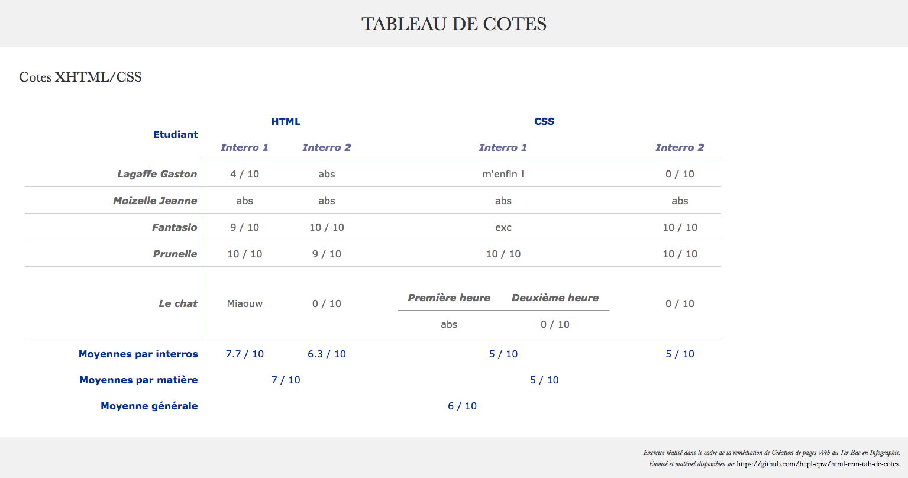
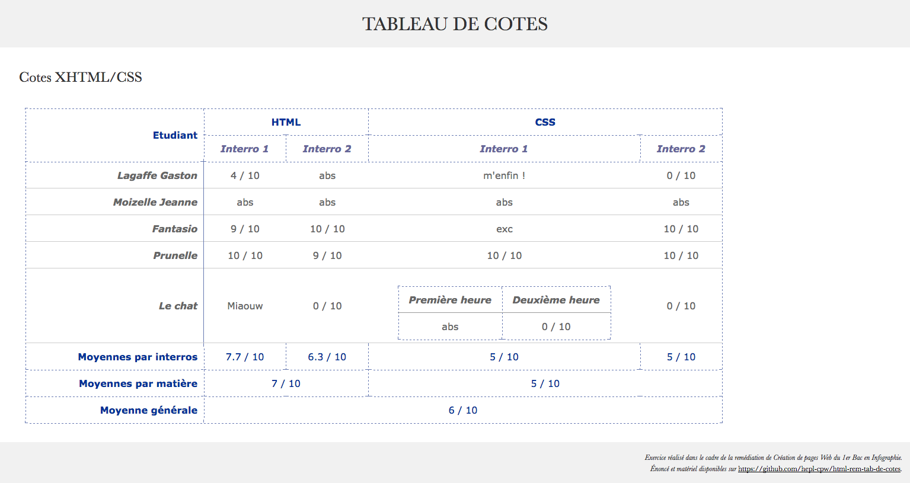

# "Tableau de cotes"

> HTML exercise given at HEPL

* * *

**"Tableau de cotes"** is an educational project, which will be used for `HTML` remedial courses.

**Note:** the school where the course is given, the [HEPL](http://www.provincedeliege.be/hauteecole) from Liège, Belgium, is a french-speaking school. From this point, the instruction will be in french. Sorry.

* * *

> Lors de vos cours de *web*, vous allez découvrir les langages HTML et CSS et les mettre en pratique pour apprendre à créer des pages web.  

* * *

## Tableau de cotes

Vous trouverez dans ce dossier un fichier texte HTML nommé **index.html**. Cette page contiendra un tableau ainsi qu'un sous-tableau afin de présenter des cotes obtenues lors d'évaluations de HTML et CSS par des étudiants.

Votre but est 

- de structurer les données dans un tableau de manière appropriée en prêtant une attention particulière à divers aspects&nbsp;:
	* quelles cellules sont des cellules de titres ou de données&nbsp;?
	* quelles fusions de lignes et/ou de colonnes sont nécéssaires&nbsp;?
	* quelles informations font partie de l'entête, du corps ou du pied du tableau&nbsp;?
	* où inscrire le sous-tableau dans ce tableau et quelles cellules de ce sous-tableau sont des cellules de titres ou de données&nbsp;? 
	* quand et où utiliser les attributs `scope` ou `headers` (en liaisons avec des `id`)&nbsp;?
- de valider votre page
    
Cet énoncé présente les rendus à obtenir (le code html donné prévoit un style alterné permettant de mieux visualiser les fusions de cellules et le sous-tableau) ainsi que la liste précise des balises et attributs à utiliser (obligatoirement).

* * *

## Voici les 2 rendus (style par défaut et style alterné)&nbsp;:

### Rendu de index.html (style par défaut)

### Rendu de index.html (style alterné)

* * *

## Voici la liste des balises et attributs à utiliser (obligatoirement)&nbsp;:

#### Les balises à utiliser (obligatoirement)&nbsp;:

- `table`
- `caption`
- `thead`
- `tbody`
- `tfoot`
- `tr`
- `th`
- `td`

#### Les attributs à utiliser (obligatoirement)&nbsp;:

- `rowspan`
- `colspan`
- `scope`
- `id`
- `headers`

Pour bien utiliser ces balises et ces différents attributs, assurez-vous de bien comprendre leur sémantiques et leur utilisations.

* * *

Bon travail !
